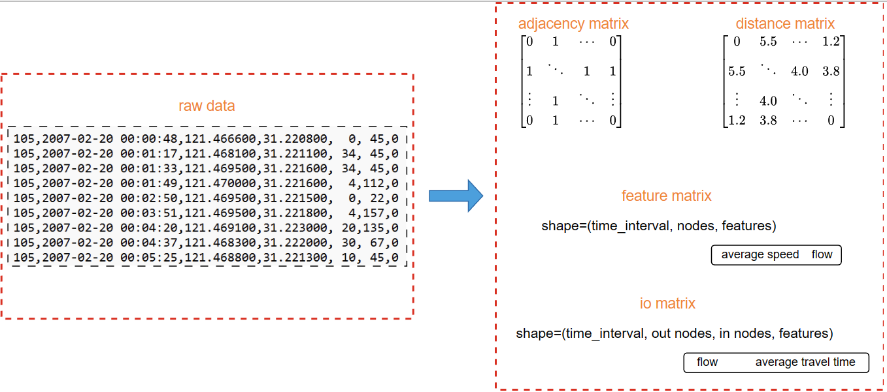

# GPS2Graph
Transform GPS trajectory data into graph data!

Latest version: 0.0.2



|    Method     |        Input        |                            Output                            |
| :-----------: | :-----------------: | :----------------------------------------------------------: |
| By clustering | raw trajectory data | distance matrix\|io matrix\|feature matrix\|adjacency matrix |
|    By grid    | raw trajectory data |         io matrix\|feature matrix\|adjacency matrix          |

***

#### Notes:

1.raw data link for test [scrg](https://cse.hkust.edu.hk/scrg/)

2.io matrix: traffic flow and average travel time from one node to another over a period of time

3.Provide speed calculation function

4.Map matching is temporarily not supported

***

#### Usage:

1.create and activate your conda environment

```python
conda create -n name python==3.8
activate name
```

2.download required packages

```python
pip install -r requirements.txt
```

3.create a folder named 'saved_files' to save the results

4.running python file

```python
python gps2graph.py
```

5.upload files, set parameters and choose methods

***

#### TODO:

- [x] 1.add  transformation method with clustering
- [x] 2.add more settable parameters
- [ ] 3.segment feature matrix to train set, validation set, and test set

